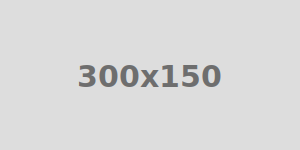

# Simple SVG Placeholder

> A very simple placeholder image generator with zero dependencies.

## Installation

```
npm i --save @cloudfour/simple-svg-placeholder
```

## Usage




```javascript
simpleSvgPlaceholder();
```
